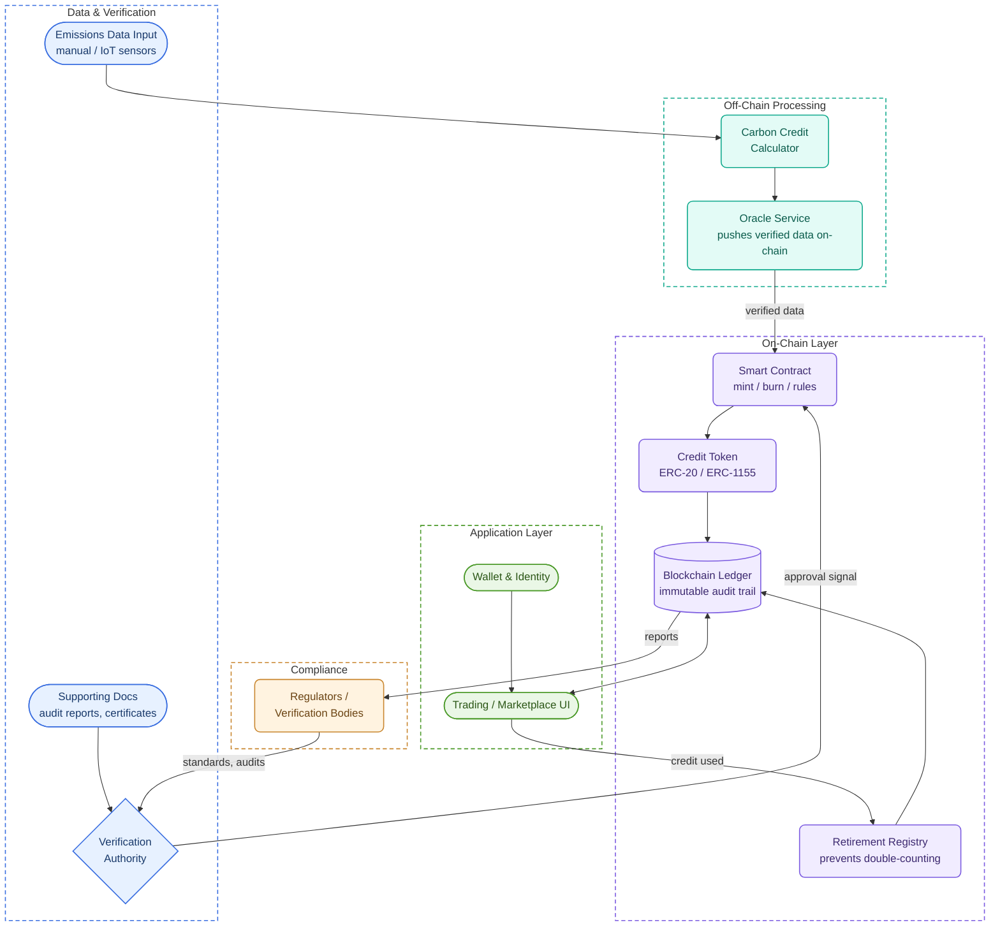

# 🌱 Blockchain-Based Carbon Credit Trading Platform
A decentralized platform for transparent, secure, and efficient carbon credit trading using blockchain technology.

## 🚀 Project Overview
This project leverages blockchain technology to address inefficiencies in the current carbon credit trading systems by providing a secure, immutable, and transparent platform for emission tracking, credit allocation, and trading.

## 🧩 Features
- 🔐 **Blockchain Ledger:** Immutable record of all carbon credit transactions.
- 🧾 **Smart Contracts:** Automates credit issuance, transfer, and verification.
- 🌍 **Emission Calculator:** Calculates carbon credits based on input emission data.
- 👤 **User Roles:** Companies, verifiers, and regulatory bodies.
- 📊 **Dashboard:** Real-time credit status, emissions data, and trading history.

## 🏗️ Architecture

## 📦 Tech Stack
- **Frontend:** HTML, CSS, JS (optionally React)
- **Backend:** Node.js, Express
- **Blockchain:** Ethereum / Polygon, Solidity (Smart Contracts)
- **Database:** IPFS / MongoDB for off-chain storage

## 📌 Problem Statement
Traditional carbon credit systems are prone to fraud, inefficiency, and lack of transparency. This platform resolves these challenges by decentralizing the ecosystem and ensuring data authenticity using blockchain.

## 🎯 Objectives
- Ensure trust, traceability, and transparency in carbon credit transactions.
- Simplify verification and validation of carbon offsets.
- Encourage broader participation in carbon reduction.

## 📈 Future Scope
- Integrate with IoT sensors for real-time emission monitoring.
- Support carbon offset NFT minting.
- Expand to international carbon markets with cross-chain interoperability.

## 📑 License
This project is licensed under the MIT License.
